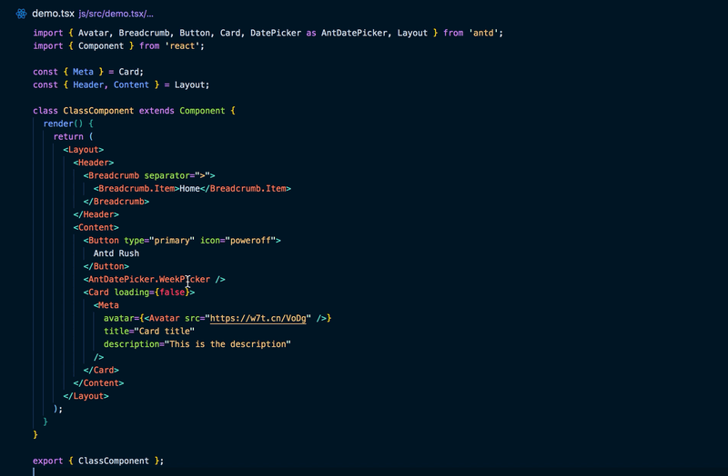
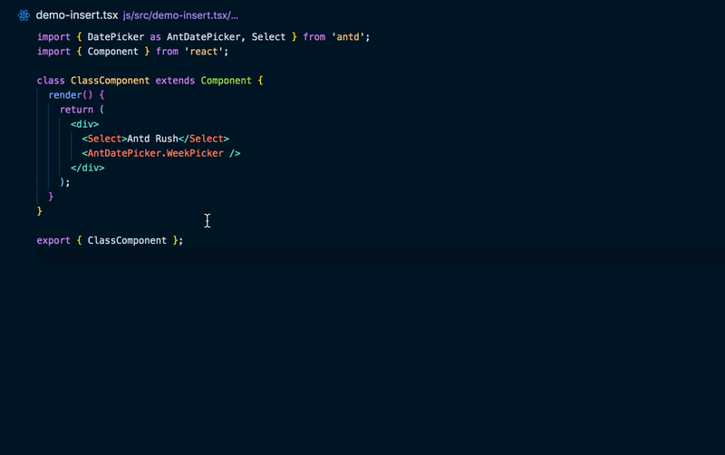

## 专属 heaven 插件

vscode 应用商店搜索：`heaven-code-helper`，可安装 heaven 专属 vscode 插件

> 支持查看最新 heaven2.0 文档

### 悬浮提示组件 props 表格

- 悬浮在组件上显示官方文档的组件详情
- 提供链接直接跳转到 heaven 的官方文档页面
- 悬浮在 props 上显示官方文档的 props 详情

### 自动插入 method handler

- 触发 `!` 自动插入带默认前缀的 handler（默认前缀预置为 `handle`，可配置）
- 触发 `~` 在提示输入 handler name 后插入
- 暂时不会为 TypeScript 自动添加类型标注

- class component 插入的模板为

`this.handleMethod = () => {};`

- functional component 插入的模板为

`const handleMethod = () => {};`

